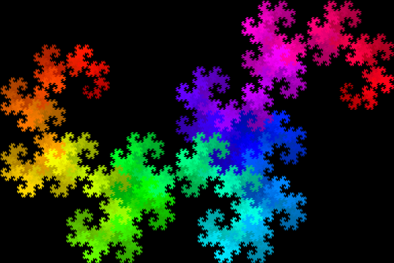

# `fract.cpp` prints fractal picture to stdout:

```
         .......------------------------:::::::::;;;;+=X X & ;:::::::------.....
       ......------------------------::::::::::;;;;+==x&  &x=+;;;::::::-------..
      ....------------------------::::::::::;;;;++=X         X=;;;;;:::::-------
     ...-----------------------::::::::::;;+++++==xX         Xx=+++;;;;;:::-----
    ..----------------------::::::::;;;;+x   &XX               & $x===x +;::----
   ..--------------------::::;;;;;;;;+++=x&                             $+;::---
  ..----------------::::;;;;;;;;;;++++=x$                              $=+;;::--
  .-----------:::::;;= x+++++++++====xx&                               &xx+;:::-
 .-----:::::::::;;;++=$  &$X$ &XXXxxXX&                                   x+;:::
 ---:::::::::;;;;;;+==X$            &                                    &=;;:::
 -::::::::;;;;;;+=xxX$                                                   x+;;:::
 ::;;:::++++++==xX&                                                     =+;;;:::
                                                                      Xx=+;;;:::
 ::;;:::++++++==xX&                                                     =+;;;:::
 -::::::::;;;;;;+=xxX$                                                   x+;;:::
 ---:::::::::;;;;;;+==X$            &                                    &=;;:::
 .-----:::::::::;;;++=$  &$X$ &XXXxxXX&                                   x+;:::
  .-----------:::::;;= x+++++++++====xx&                               &xx+;:::-
  ..----------------::::;;;;;;;;;;++++=x$                              $=+;;::--
   ..--------------------::::;;;;;;;;+++=x&                             $+;::---
    ..----------------------::::::::;;;;+x   &XX               & $x===x +;::----
     ...-----------------------::::::::::;;+++++==xX         Xx=+++;;;;;:::-----
      ....------------------------::::::::::;;;;++=X         X=;;;;;:::::-------
       ......------------------------::::::::::;;;;+==x&  &x=+;;;::::::-------..
```

# `pi_c.cpp` calculates PI digits with spigot algorithm:


31415926535897932384626433832795028841971693993751058209749445923078164062862089986280348253421170679821480865132823066470938446095505822317253594081284811174502841027019385211055596446229489549303819644288109756659334461284756482337867831652712019091456485669234603486104543266482133936072602491412737245870066063155881748815209209628292540917153643678925903600113305305488204665213841469519415116094330572703657595919530921861173819326117931051185480744623799627495673518857527248912279381830119491298336733624406566430860213949463952247371907021798609437027705392171762931767523846748184676694051320005681271452635608277857713427577896091736371787214684409012249534301465495853710507922796892589235420199561121290219608640344181598136297747713099605187072113499999983729780499510597317328160963185


# `pi_naive.cpp` calculates PI with naive infinity series:
```
Naive 10 iterations:           
   3.140578169680336096
Naive 30 iterations:           
   3.141592653003481672
Naive 50000 iterations:           
   3.141592653589792228
Reference value, 28 digits:    
   3.141592653589793238462643383
Rational approximation 355/113:
   3.141592920353983
```
# `sierpinski.cpp` draws square Sierpinsky carpet:
```
######################################################
##  ####  ####  ####  ####  ####  ####  ####  ####  ##
######################################################
######      ############      ############      ######
##  ##      ##  ####  ##      ##  ####  ##      ##  ##
######      ############      ############      ######
######################################################
##  ####  ####  ####  ####  ####  ####  ####  ####  ##
######################################################
##################                  ##################
##  ####  ####  ##                  ##  ####  ####  ##
##################                  ##################
######      ######                  ######      ######
##  ##      ##  ##                  ##  ##      ##  ##
######      ######                  ######      ######
##################                  ##################
##  ####  ####  ##                  ##  ####  ####  ##
##################                  ##################
######################################################
##  ####  ####  ####  ####  ####  ####  ####  ####  ##
######################################################
######      ############      ############      ######
##  ##      ##  ####  ##      ##  ####  ##      ##  ##
######      ############      ############      ######
######################################################
##  ####  ####  ####  ####  ####  ####  ####  ####  ##
######################################################
```
# `dragon.cpp` draws colorfull dragon curve into image file in PNM graphic format (use output redirection: `Scinc dragon.cpp > dragon.pnm`):


